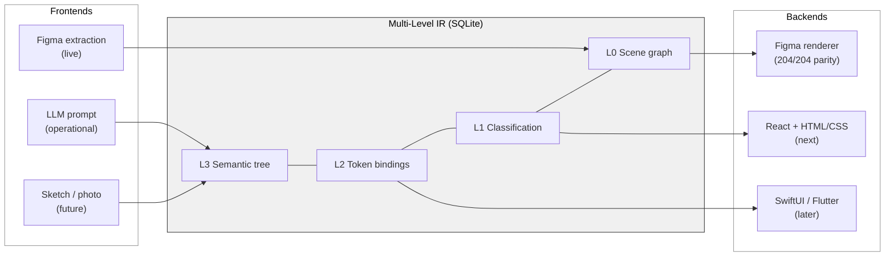

# Declarative Design

An MLIR-style compiler for design systems. It ingests a design source
(today: Figma), normalises it into a multi-level intermediate
representation, and renders that IR back out to a target (today: Figma,
for round-trip validation; next: React + HTML/CSS). One IR, many
frontends, many backends. The same structural trick LLVM uses for
programming languages, applied to design artifacts.

Round-trip parity on the test corpus is 204 / 204 app screens, verified
at node granularity by a structured verifier.
[`docs/roadmap.md`](docs/roadmap.md) has what's next; the headline items
are a React renderer and synthetic screen generation.

## What it does

| Capability | State |
|---|---|
| Extract a Figma file into a queryable SQLite database | Complete. ~87 K nodes × 77 properties per node extracted in ~220 s for the test corpus. |
| Cluster raw property values into token proposals (colour, spacing, typography, radius, effects) | Complete. Proposals are conservative and benefit from human review before push. |
| Curate, accept, rename, merge token proposals | CLI + batch accept-all. |
| Render the IR back to a Figma Plugin script that rebuilds the file | Complete. Three-phase emit with progressive fallback from token refs to component instances to raw values. |
| Push curated tokens back to Figma as live variables plus rebound bindings | Complete. Two-phase manifest (create variables, then rebind). |
| Generate a screen from a natural-language prompt | Operational end to end. Text becomes a component list, becomes IR, becomes Figma script. |
| Verify a rendered subtree against the IR | Complete. Unified structured-error channel with per-node granularity. |
| React + HTML/CSS renderer | Not started. Primary next target. |
| SwiftUI, Flutter renderers | Not started. Same pattern, later. |
| Synthetic screen generation from prompt, sketch, or image | Not started. Next major phase. |

## Install

Prerequisites:

- Python 3.11 or newer
- Node 18 or newer (for the Figma Desktop Bridge runner scripts)
- A Figma personal access token with file-read permission
- Optional: Figma Desktop plus the
  [figma-console-mcp](https://github.com/figma/figma-console-mcp) bridge
  plugin. Required only for the Plugin-API-only fields (instance
  overrides, relative transforms, vector authoring paths, OpenType
  features). The REST-only path works without it.

Clone and set up the Python side:

```bash
git clone https://github.com/mpacione/declarative.git
cd declarative

python3 -m venv .venv
source .venv/bin/activate
pip install -r requirements.txt
pip install -e .
```

Install the Node dependency for the bridge runner scripts:

```bash
npm install
```

Configure your Figma token:

```bash
echo 'FIGMA_ACCESS_TOKEN=figd_...' > .env
```

Run the tests to confirm the install:

```bash
pytest tests/ -q
```

You should see ~1,979 tests passing.

### First extract and render

```bash
# REST-only extraction. Writes <FILE_KEY>.declarative.db in the cwd.
python3 -m dd extract "https://www.figma.com/design/<FILE_KEY>/<Name>"

# (Optional, needs Figma Desktop + bridge plugin running on port 9231)
# Fills the Plugin-API-only fields: relative_transform, vector_paths,
# OpenType features, instance overrides.
python3 -m dd extract-plugin --port 9231

# Generate a Figma Plugin script for one screen.
python3 -m dd generate --screen <screen_id> > /tmp/out.js

# Execute it against the bridge and walk the result, then verify parity.
node render_test/walk_ref.js /tmp/out.js /tmp/walk.json 9231
python3 -m dd verify --screen <screen_id> --rendered-ref /tmp/walk.json

# Sweep the whole corpus.
python3 render_batch/sweep.py --port 9231
```

## Use with Claude Code

Once installed, the project is designed to be driven conversationally.
With Claude Code open in the project directory:

| You say | What happens |
|---|---|
| "Extract my Figma file." | `dd extract` via REST, then `dd extract-plugin` for the Plugin-only fields. |
| "Cluster the tokens." | OKLCH colour grouping, type-scale detection, spacing-pattern discovery. |
| "Generate a settings screen." | LLM writes L3 YAML, compiler fills L2 / L1 / L0, renderer emits a Figma script. |
| "Export to CSS." | `:root { --color-surface-primary: #fff; }`, plus Tailwind and W3C DTCG variants. |
| "Push tokens to Figma." | Creates live Figma variables, binds node properties to them. |
| "Add a dark mode." | OKLCH lightness inversion, preserves hue and chroma. |
| "Check for drift." | Diffs DB tokens against live Figma variables. |

## The IR

The mental model that matters more than anything else in this repo.

Every level ADDS information on top of the one below it. None of them
replaces the one below. L0 is always the ground truth; L1, L2, and L3
are annotations and abstractions that sit on top.

```
    ┌──────────────────────────────────────────────────────────────┐
    │  L3   Semantic tree                    intent, LLM-native    │
    │       { settings: { header, dark_toggle, logout_button } }   │
    │                                                              │
    │  L2   Token bindings                   design-system refs    │
    │       node.padding = {space.lg}                              │
    │       node.fill    = {color.surface.primary}                 │
    │                                                              │
    │  L1   Classification                   component identity    │
    │       node 22068 → canonical_type: "button"                  │
    │                                                              │
    │  L0   Scene graph                      complete, lossless    │
    │       node 22068: FRAME, 428×80, fill #09090B,               │
    │                   cornerRadius 16, parent_id 22001, ...      │
    └──────────────────────────────────────────────────────────────┘

         Extract (bottom-up)                Generate (top-down)
         ─────────────────▲                 ▲──────────────────
                          │                 │
                    Figma file         Prompt / sketch / image
                                           (LLM writes L3)

         Render (reads highest level available, falls back)
         ─────────────────▼
                    Figma / React / SwiftUI / ...
```

**Extraction is bottom-up.** Parsing a Figma file fills L0 completely
(every visual property on every node). A classification pass reads L0
and writes L1 (this FRAME is a button, this GROUP is a card). A
clustering pass reads L0 and writes L2 (this padding value appears 847
times, propose it as `space.lg`). A semantic-compression pass reads
everything and writes L3.

**Generation is top-down.** An LLM writes L3 (a dozen lines of YAML
intent). The compiler progressively lowers: resolve the token refs
against L2, instantiate components against L1, materialise the actual
properties at L0. By the time the renderer runs, the IR is fully
populated all the way down.

**Rendering reads the highest level available.** A property with a
token binding renders as a live Figma variable or a CSS custom
property. A property without one renders as a literal value from L0.
Both are correct. One is more portable.

This structure is why synthetic generation is tractable. The LLM's job
is small: write L3. The compiler's job is big but deterministic: lower
through L2 and L1 to L0, then render. The same IR carries both
directions, and the same [verification channel](docs/architecture-decisions.md)
checks both directions.

Full treatment in [`docs/compiler-architecture.md`](docs/compiler-architecture.md):
spatial encoding, renderer phases, token pipeline, glossary.

## Architecture at a glance



For the full-system view with compiler passes and the verification
channel, see [`docs/compiler-architecture.md`](docs/compiler-architecture.md).

## Current limits

- **One source, one target today.** Figma in, Figma out. The React
  renderer is the next piece.
- **One file tested at depth.** Dank Experimental is the entire
  corpus. The extractor is registry-driven and should generalise, but
  that claim is not yet validated on a second file.
- **Token clustering is heuristic.** It works on the test corpus but
  proposals benefit from curator review before push. Accurate to call
  this "clustering plus curation", not "fully automatic".
- **Plugin-API extraction needs the Figma Desktop bridge.** REST
  covers about 75 % of properties; the last 25 % (relative transforms,
  vector authoring paths, OpenType features, instance overrides)
  requires the Plugin API. Build-time dependency, not runtime.
- **Synthetic generation is a plan, not running code yet.** The
  architecture is positioned for it (see [`docs/roadmap.md`](docs/roadmap.md)).

## What's next

Three priorities:

1. **React + HTML/CSS renderer.** The second backend and the first
   real test of the IR's cross-platform claim.
2. **Additional backends and extractors.** SwiftUI, Flutter, and
   potentially Sketch / Penpot / W3C DTCG on the ingest side. Routine
   after React lands.
3. **Synthetic screen generation.** Prompt to IR to (existing,
   deterministic) renderer. Claude API to start. Fall-through chain:
   real component library, then symbols in the DB, then raw composition,
   then a small curated defaults library.

See [`docs/roadmap.md`](docs/roadmap.md) for the full picture, including
the synthetic-generation model choice, input-modality sequence, and
open questions.

## Documentation

| Document | Purpose |
|---|---|
| [`docs/compiler-architecture.md`](docs/compiler-architecture.md) | Authoritative technical spec. IR levels, spatial encoding, renderer phases, token pipeline, round-trip requirements, glossary. |
| [`docs/module-reference.md`](docs/module-reference.md) | Per-module capability inventory and public API. |
| [`docs/architecture-decisions.md`](docs/architecture-decisions.md) | ADRs 001 through 007 and chapter history. |
| [`docs/roadmap.md`](docs/roadmap.md) | What's coming next. |
| [`docs/cross-platform-value-formats.md`](docs/cross-platform-value-formats.md) | Per-renderer value transforms (hex to rgba vs `Color()` vs `Color(0xAARRGGBB)`, etc.). |
| [`docs/extract-performance.md`](docs/extract-performance.md) | Measured pipeline timings. |

## License

MIT
