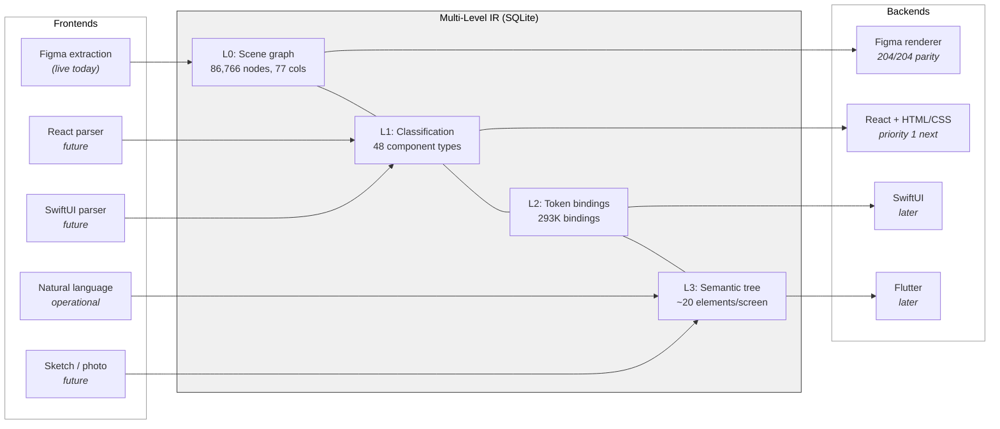
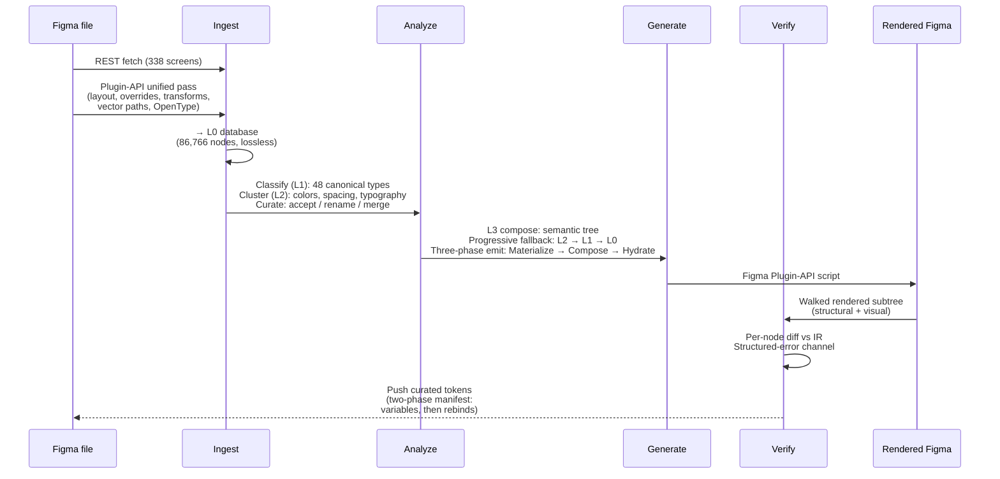
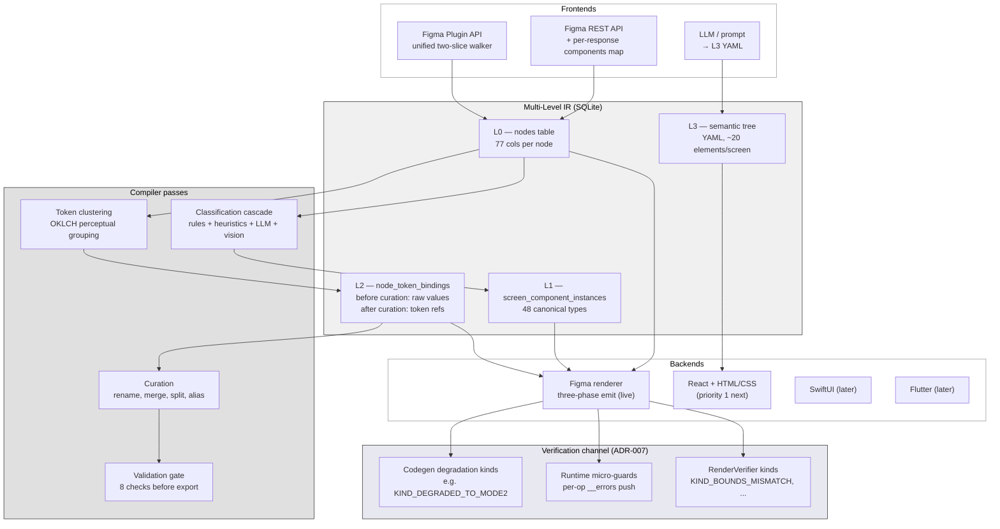

# Declarative Design

**An MLIR-style compiler for design systems.** Takes a design source
(today: a Figma file), translates it to a design target (today: Figma
again, for round-trip validation; soon: React + HTML/CSS) through a
multi-level intermediate representation modelled after
[MLIR](https://mlir.llvm.org/). One IR, many frontends, many backends —
the same trick LLVM uses for programming languages, applied to design
artifacts.

Currently at the end of the "round-trip foundation" phase. The claim
we can defend, and the invariant load-bearing for everything
downstream:

> **Every app screen in our test file (204 / 204) extracts to the
> database, generates a script from the database, executes that
> script in Figma, and produces a rendered subtree whose structural
> and visual properties match the original at `parity_ratio = 1.0000`,
> zero structured errors, across the entire corpus.**

The verifier is not "does it look right to a human." It walks the
rendered subtree node-by-node, compares against the IR node-by-node,
and raises a structured error on any mismatch. The 204 / 204 result
is machine-checked.



---

## Why this project exists

Every serious design system lives twice — once as a design file, once
as production code. They drift. Token values diverge. Components
diverge. Layout diverges. The tools that exist today either convert in
one direction, cover only a slice, or require a human to stitch the
pieces back together.

| System | Design tools | Code | Layout | Tokens | Bidirectional |
|---|:---:|:---:|:---:|:---:|:---:|
| Figma Dev Mode | Yes | One-way | Partial | Partial | No |
| Mitosis (Builder.io) | No | Yes | No | No | No |
| W3C Design Tokens | No | Values only | No | Yes | N/A |
| **This system** | **Yes** | **Yes** | **Yes** | **Yes** | **Yes** (foundation verified) |

The move inspired by LLVM is: **put an IR in the middle.** Extraction
passes become frontends. Renderers become backends. Classification,
token clustering, semantic compression become IR passes, written once,
reused by every backend. A React renderer and a SwiftUI renderer share
the same understanding of what "this FRAME is a button, its padding is
`space.lg`, its fill is the `--accent` color token" means. They just
emit different syntax.

The foundational question — *can the IR round-trip to its source with
zero loss?* — has a machine-checked answer on the one-source
one-target case. Scaling to more targets is the next phase.

---

## What it does today

| Capability | State |
|---|---|
| **Extract** from Figma (REST + Plugin API, unified pass) | Complete — 338 screens × 86,766 nodes in 221 s |
| **Normalise** into a multi-level IR | L0 complete; L1 / L2 operational with curation |
| **Cluster** raw values into token proposals (colors, spacing, typography, effects, radius) | Complete — backed by SQL census views |
| **Curate** proposed tokens (accept, reject, merge, rename) | CLI + batch accept-all |
| **Push** curated tokens back to Figma as live variables + rebound bindings | Complete — two-phase manifest |
| **Render** the IR to a Figma script that rebuilds the file | Complete — 204 / 204 app screens at `is_parity = True` |
| **Verify** rendered subtrees against the IR | Complete — unified structured-error channel, per-node granularity |
| **Generate** a screen from a natural-language prompt | Operational end-to-end — text → component list → IR → Figma script |
| React / HTML-CSS renderer | Not started — primary next target |
| SwiftUI, Flutter renderers | Not started — same pattern, later |
| Synthetic screen generation | Not started — next major phase (see [roadmap](docs/roadmap.md)) |

### The pipeline, end to end



---

## The IR, briefly

Inspired by [MLIR](https://mlir.llvm.org/). Core principle: **levels
coexist, each adds information, none removes it.**

| Level | What | Storage | Example |
|---|---|---|---|
| **L0** | Complete scene graph | `nodes` table (77 columns) | node 22068: FRAME, 428×80, fill `#09090B`, `cornerRadius: 16`, `relative_transform: [[1,0,x],[0,1,y]]` |
| **L1** | Classification | `screen_component_instances` | node 22068 → `canonical_type: "button"`, confidence 1.0 |
| **L2** | Token bindings | `node_token_bindings` | node 22068's fill is `{color.surface.primary}` |
| **L3** | Semantic tree (YAML) | emitted, not stored | `button: { component: button/solid, text: Save }` |

Every renderer reads the **highest level available** for each property
and falls back to lower levels. A property with a token binding
renders as a live Figma variable or a CSS custom property. A property
without one renders as a literal value from L0. Both are correct; one
is more portable. Renderers never fail — they degrade gracefully from
semantic (tokens + components) to literal (raw values + generic
elements). L0 is always the safety net.

See [`docs/compiler-architecture.md`](docs/compiler-architecture.md)
for the complete spec, spatial-encoding rules, renderer phases, and
L3 YAML examples.

---

## Numbers (Dank Experimental, the test corpus)

| | |
|---|---:|
| Figma file | Dank (Experimental), mobile / tablet meme app |
| App screens verified | **204 / 204** at `is_parity = True` |
| Nodes extracted | 86,766 |
| INSTANCE nodes (component references) | 27,811 |
| Component-key registry (Mode 1 lookup table) | 129 components |
| Content-addressed SVG path assets | 253 unique, 26,050 node references |
| Node-property token bindings | 293,183 |
| Full extraction pipeline (cold) | 221 s |
| Full corpus round-trip sweep | 449 s (2.2 s / screen) |
| Test count | 1,979 |
| Architectural Decisions (ADRs) on record | 7 |

The parity sweep is reproducible:
`python3 render_batch/sweep.py --port N`. It writes a per-screen
`RenderReport` JSON and an aggregate summary.

---

## Quick start

```bash
git clone <repo> && cd declarative-build
python3 -m venv .venv && source .venv/bin/activate
pip install -e .

# Figma API token
echo 'FIGMA_ACCESS_TOKEN=figd_...' > .env

# Extract a Figma file to SQLite (REST-only; fast)
python3 -m dd extract "https://www.figma.com/design/<FILE_KEY>/<Name>"

# Plugin-API supplement (needs Figma Desktop + bridge plugin)
# — fills fields REST doesn't expose: relative_transform, vector_paths,
#   OpenType features, instance overrides
python3 -m dd extract-plugin --port 9231

# Render one screen end-to-end and check parity
python3 -m dd generate --screen 324 > /tmp/out.js
node render_test/walk_ref.js /tmp/out.js /tmp/walk.json 9231
python3 -m dd verify --screen 324 --rendered-ref /tmp/walk.json

# Sweep the whole corpus
python3 render_batch/sweep.py --port 9231

# Cluster raw property bindings into token proposals
python3 -m dd cluster

# Accept all proposals (for a trusted extraction) — or use curate-report
# for interactive review
python3 -m dd accept-all

# Push curated tokens back to Figma as live variables + rebound bindings
python3 -m dd push
```

## Use with Claude Code

The project is designed to be driven conversationally. With Claude Code
open in the project directory:

| You say | What happens |
|---|---|
| "Extract my Figma file" | `dd extract` via REST + `dd extract-plugin` |
| "Cluster the tokens" | OKLCH color grouping, type-scale detection, spacing patterns |
| "Generate a settings screen" | LLM → L3 YAML → compile to all levels → Figma script |
| "Export to CSS" | `:root { --color-surface-primary: #fff; }` |
| "Push tokens to Figma" | Creates live Figma variables, binds to nodes |
| "Add a dark mode" | OKLCH lightness inversion, preserves hue / chroma |
| "Check for drift" | Compares DB tokens against live Figma variables |

---

## Architecture, at a higher resolution



### Safety at every boundary

Two architectural decisions back the pipeline's trustworthiness:

- **Boundary contract (ADR-006).** Every external-system boundary
  (ingest from Figma, freshness-probe of Figma) runs through an
  adapter that converts transient errors, null responses, and
  malformed payloads into structured entries rather than crashes or
  silent drops. One batch timing out does not stop the pipeline; it
  produces a `KIND_API_ERROR` entry and the other batches continue.
- **Unified verification channel (ADR-007).** Round-trip success is
  redefined from "no exceptions were thrown" to `is_parity == True`
  at the IR level. Every failure mode has a named `KIND_*`; every
  `KIND_*` is visible to tooling and potential training signal.

These contracts make the round-trip test believable. Without them a
`is_parity = True` result could mean "everything worked" *or* "the
render silently ate three text nodes and the walk didn't notice."
With them, parity means parity.

---

## Design principles

- **Progressive fallback, not progressive enhancement.** Renderers
  start from the richest data available and degrade gracefully. A
  screen with full token bindings gets live variables. A screen with
  no tokens gets hardcoded values. Both render correctly.
- **The IR stays pure.** Platform-specific concerns (Figma's
  three-phase ordering, CSS's `display: flex` requirement) live in
  the renderer, not the IR. The IR stores intent; renderers translate
  to platform constraints.
- **Ground truth from source, not inference.** Extract actual values
  from the design tool. Don't infer sizing from parent context or
  guess font weights from style names. Heuristics compound.
- **Single source of truth.** The property registry drives all
  pipeline stages. Add a property once, it flows everywhere. No
  parallel lists that drift apart.
- **Fail open, not closed.** Unknown data is preserved, not stripped.
  Unexpected clipping is more destructive than missing clipping.
- **Capability-gated emission.** Every property has a per-backend
  capability. `is_capable()` is the single source of truth at every
  emit site — and doubles as a constrained-decoding grammar for
  synthetic IR generation.

---

## Current limits, honestly

- **One source, one target.** Figma → Figma. React / CSS is next,
  not yet.
- **One file tested.** Dank Experimental is the entire corpus;
  generalisation to other Figma files is plausible given the
  extractor is registry-driven, but is not yet demonstrated at the
  same depth.
- **Token clustering is heuristic.** It works on the test corpus but
  proposals benefit from curator review before push. "Clustering +
  curation" is accurate; "fully automatic" is not.
- **Plugin-API extraction requires a running Figma Desktop bridge.**
  The REST-only path covers ~75 % of properties; the last 25 %
  (relative transforms, vector paths, OpenType features, overrides)
  needs the Plugin API. Build-time dependency, not runtime.
- **Synthetic generation is the next phase, not this one.** The
  architecture is positioned for it; the code isn't there yet.

---

## What's next

The headline item on the roadmap is a **React + HTML/CSS renderer** —
the first genuinely new backend and the first real test of the IR's
cross-platform claim. In parallel we're beginning work on **synthetic
screen generation**: text prompts (and eventually image / sketch
inputs) through a Claude-API-driven generator that emits IR, which the
existing Figma renderer (and, soon, the React renderer) turns into
running output.

See [`docs/roadmap.md`](docs/roadmap.md) for the full picture —
including the synthetic-generation fall-through chain (component
library → symbols in DB → raw composition → robust defaults), input
modalities, model choice, and open questions.

---

## Documentation

| Document | Purpose |
|---|---|
| [`docs/compiler-architecture.md`](docs/compiler-architecture.md) | Authoritative technical spec: IR levels, spatial encoding, renderer phases, token pipeline, round-trip requirements, glossary |
| [`docs/module-reference.md`](docs/module-reference.md) | Per-module capability inventory and public API |
| [`docs/architecture-decisions.md`](docs/architecture-decisions.md) | ADRs 001..007 and chapter history |
| [`docs/roadmap.md`](docs/roadmap.md) | What's coming next |
| [`docs/cross-platform-value-formats.md`](docs/cross-platform-value-formats.md) | Per-renderer value transforms (hex → rgba vs Color(), etc.) |
| [`docs/extract-performance.md`](docs/extract-performance.md) | Measured pipeline timings |

---

## License

MIT
