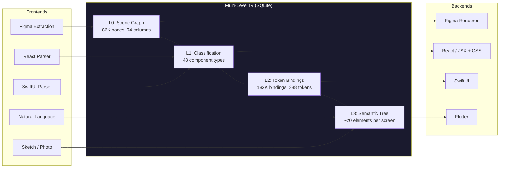
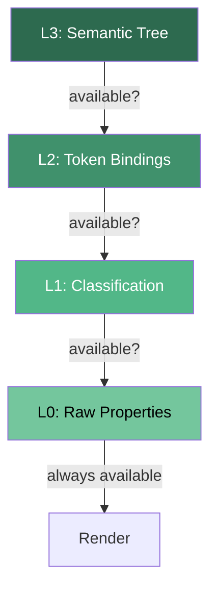
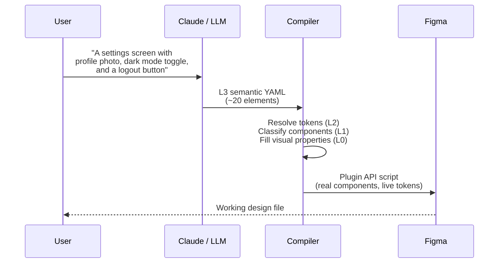
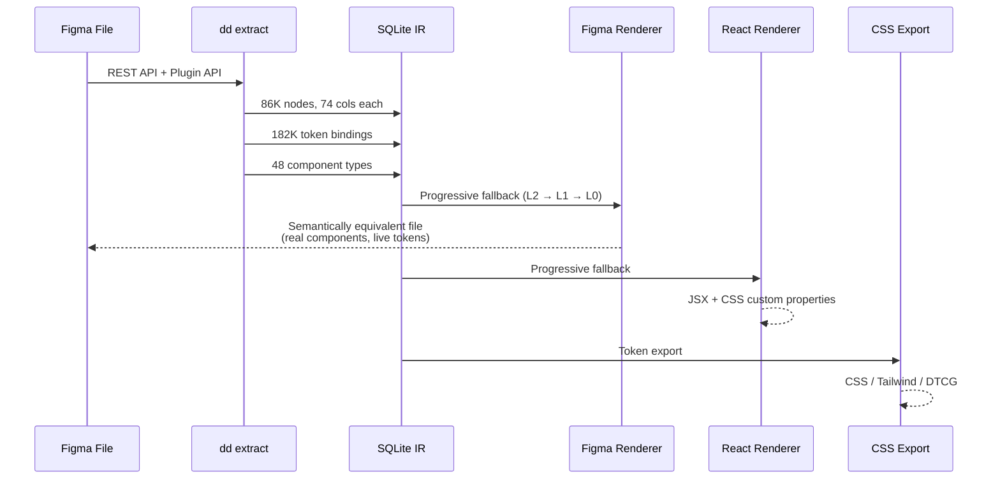
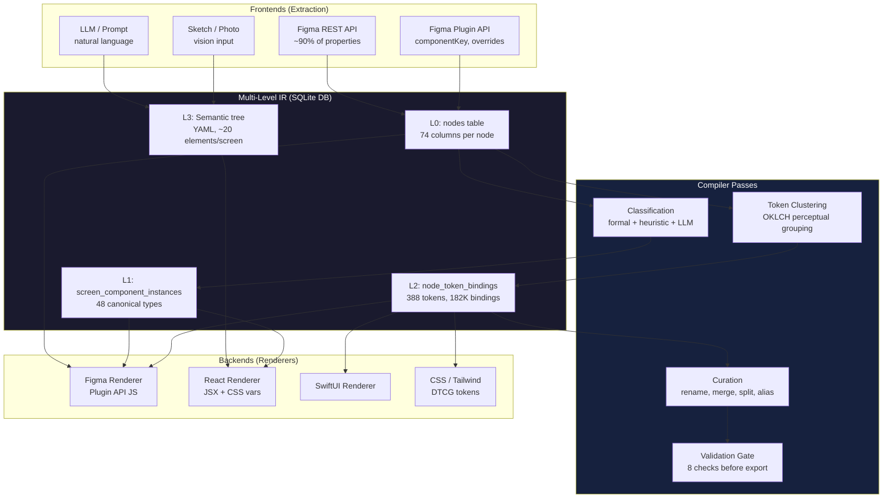
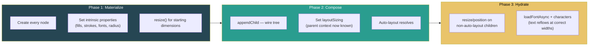

# Declarative Design

**The LLVM of design.** A compiler that translates UI between any source and any target through a multi-level intermediate representation — so you can speak interfaces into existence, sketch them on a napkin, or build them in Figma, and the system faithfully renders them anywhere.

```
          FRONTENDS                                    BACKENDS

  "A settings screen        ┌──────────────────┐       Figma file
   with a dark mode    ───> │                  │ ───>  (real components,
   toggle"                  │   Multi-Level    │       live tokens)
                            │                  │
  Figma file           ───> │   IR             │ ───>  React / JSX
                            │                  │
  React component      ───> │   L0  L1  L2  L3 │ ───>  SwiftUI
                            │                  │
  Sketch / photo       ───> │                  │ ───>  Flutter
                            └──────────────────┘
```

Designers work declaratively ("I want a card with these tokens") or imperatively (pixel-pushing in Figma). Developers describe UI in natural language, sketches, or code. The compiler understands all of it through the same IR — and can faithfully translate between any pair.

---

## Why This Exists

Every design-to-code tool today is a one-way street. Figma exports to React, but React can't update Figma. A design system lives in Figma AND code AND documentation, and they drift apart constantly.

The core insight: **this is a compiler problem.** LLVM solved it for programming languages — one IR, many frontends, many backends. We solve it for design.

| System | Design Tools | Code | Layout | Tokens | Bidirectional |
|--------|:-----------:|:----:|:------:|:------:|:-------------:|
| Figma Dev Mode | Yes | One-way | Partial | Partial | No |
| Mitosis (Builder.io) | No | Yes | No | No | No |
| Style Dictionary | No | Values only | No | Yes | No |
| W3C Design Tokens | No | Values only | No | Yes | No |
| **Declarative Design** | **Yes** | **Yes** | **Yes** | **Yes** | **Yes** |

---

## How It Works

### The Compiler Model



Each frontend fills the IR levels it can. Each backend reads from the **highest level available** and falls back to lower levels for missing data. L0 is always the safety net — complete and lossless.

### The Four IR Levels

Inspired by [MLIR](https://mlir.llvm.org/) (Multi-Level IR, LLVM project). Core principle: **levels coexist, each adds information, none removes.**

| Level | What | Storage | Example |
|-------|------|---------|---------|
| **L0** | Complete scene graph | `nodes` table (74 cols) | Node 22068: FRAME, 428x80, fill=#09090B, cornerRadius=16 |
| **L1** | Semantic classification | `screen_component_instances` | Node 22068 is a `button` (confidence: 1.0) |
| **L2** | Design token bindings | `node_token_bindings` | Node 22068's fill is `{color.surface.primary}` |
| **L3** | Compact semantic tree | YAML | `button: { component: button/solid, text: Save }` |

An LLM producing a screen writes L3 (20 lines of YAML). The compiler fills in L2 (token bindings), L1 (component types), and L0 (all 74 visual properties). A Figma extraction fills all four levels at once. The result is the same IR — renderers don't care which frontend produced it.

### Progressive Fallback

Every renderer reads the highest IR level available and gracefully degrades:



A property with a token binding renders as a **live Figma variable** or **CSS custom property**. Without a binding, it renders as a hardcoded value from L0. Both are correct — one is more portable.

---

## Workflows

### 1. Speak UI Into Existence

Describe what you want in natural language. The LLM writes L3 (semantic YAML), the compiler fills in tokens and layout, and the renderer produces a real Figma file with live components and design tokens.



### 2. Extract and Translate

Pull a complete design system from Figma. Translate it to any target — another Figma file, React components, SwiftUI views, or CSS tokens.



### 3. Round-Trip Verification

The foundational proof that the compiler works: Figma -> DB -> Figma produces a visually identical, structurally equivalent design file. Not a flat screenshot — real components, live variables, correct hierarchy.

```
Original screen (Figma)          Reproduced screen (Figma)
┌─────────────────────┐          ┌─────────────────────┐
│  ┌───────────────┐  │          │  ┌───────────────┐  │
│  │    Header     │  │    ==    │  │    Header     │  │
│  └───────────────┘  │          │  └───────────────┘  │
│  ┌───────────────┐  │          │  ┌───────────────┐  │
│  │     Card      │  │          │  │     Card      │  │
│  │  ┌─────────┐  │  │          │  │  ┌─────────┐  │  │
│  │  │ Toggle  │  │  │          │  │  │ Toggle  │  │  │
│  │  └─────────┘  │  │          │  │  └─────────┘  │  │
│  └───────────────┘  │          │  └───────────────┘  │
│  ┌───────────────┐  │          │  ┌───────────────┐  │
│  │    Button     │  │          │  │    Button     │  │
│  └───────────────┘  │          │  └───────────────┘  │
└─────────────────────┘          └─────────────────────┘
  Components: real instances       Components: real instances
  Tokens: live variables           Tokens: live variables
  Hierarchy: preserved             Hierarchy: preserved
```

Proven on **11+ screens** (iPhone + iPad), 0.7-3.9s per screen.

---

## Quick Start

```bash
git clone https://github.com/mpacione/declarative.git
cd declarative

python3 -m venv .venv
source .venv/bin/activate
pip install -r requirements.txt

# Verify (1,816 tests)
pytest tests/ --tb=short
```

### Extract a Figma File

```bash
# Step 1: REST API extraction (no Figma Desktop needed)
python -m dd extract --file-key <your-figma-file-key> --page 0:1

# Step 2: Plugin API supplement (needs Figma Desktop + bridge plugin)
python -m dd extract-supplement --db your-file.declarative.db
```

### Use With Claude Code

```bash
claude  # Opens Claude Code in project directory
```

Then just talk:

| You say | What happens |
|---------|-------------|
| "Extract my Figma file" | `dd extract` via REST API -> SQLite |
| "Cluster the tokens" | OKLCH color grouping, type scale detection, spacing patterns |
| "Generate a settings screen" | LLM -> L3 YAML -> compile to all levels -> Figma |
| "Export to CSS" | `:root { --color-surface-primary: #fff; }` |
| "Push tokens to Figma" | Creates live Figma variables, binds to nodes |
| "Add a dark mode" | OKLCH lightness inversion, preserves hue/chroma |
| "Check for drift" | Compares DB tokens against live Figma variables |

---

## Architecture

### System Overview



### Three-Phase Rendering (Figma Backend)

The Figma Plugin API has implicit ordering constraints. The renderer uses three clean phases instead of scattering workarounds:



Each phase has a single responsibility. The boundaries eliminate an entire class of Figma Plugin API ordering bugs structurally. A React renderer wouldn't need Phase 3 at all — CSS reflows text automatically.

### Property Registry

A single source of truth (`dd/property_registry.py`) drives all pipeline stages:

```
FigmaProperty:
  figma_name ──> db_column ──> override_fields ──> value_type ──> emit pattern
       │              │              │                   │              │
       ▼              ▼              ▼                   ▼              ▼
   Plugin API     SQL SELECT    Override check     format_js_value   Template /
   extraction     columns       during decomp      type-aware        Handler /
                                                   formatting        Deferred
```

48 properties. Add one to the registry and it flows through extraction, query, overrides, and emission automatically. No parallel lists that drift apart.

---

## The IR in Detail

### L3 — What LLMs Write

```yaml
screen:
  size: [428, 926]
  layout: absolute

  header:
    component: nav/top-nav
    text: Settings

  card:
    layout: vertical
    padding: {space.lg}
    fill: {color.surface.white}

    heading: Notifications
    toggle: Push Notifications
    toggle: Dark Mode

  button:
    component: button/small/solid
    text: Save
```

20 lines. An LLM can produce this from a natural language description. The compiler resolves `{space.lg}` to `16px`, finds the `nav/top-nav` component in the registry, and fills in all 74 L0 properties needed to render it.

### L0 — What the DB Stores

74 columns per node. Complete, lossless. This is what makes round-trip possible — and what makes every downstream renderer trustworthy, because the Figma round-trip has already validated the data end-to-end.

---

## Current Status

- **Round-trip proven**: 11+ screens (iPhone + iPad), 0.7-3.9s each
- **Tests**: 1,816 passing
- **IR**: 86,761 nodes, 182,871 token bindings, 388 tokens, 338 screens
- **Properties**: 48 in registry, all emitted. 42 override types handled
- **Classification**: 93.6% coverage (47,292 / 50,517 nodes)

### What's Built

- Figma frontend (REST + Plugin API extraction)
- Figma backend (three-phase renderer with progressive fallback)
- Token pipeline (clustering, curation, validation, export)
- Natural language frontend (LLM -> L3 -> Figma)
- Export backends (CSS, Tailwind, DTCG, Figma variables)
- Round-trip verification on 11+ production screens

### What's Next

- React / SwiftUI / Flutter backends
- React / SwiftUI frontends (parser -> IR)
- Sketch / photo vision frontend
- L3 format formalization (YAML schema + constrained decoding)

---

## Design Principles

**Progressive fallback, not progressive enhancement.** Renderers start from the richest data available and degrade gracefully. A screen with full token bindings gets live variables. A screen with no tokens gets hardcoded values. Both render correctly.

**The IR stays pure.** Platform-specific concerns (Figma's three-phase ordering, CSS's `display:flex` requirement) live in the renderer, not the IR. The IR stores intent; renderers translate to platform constraints.

**Ground truth from source, not inference.** Extract actual values from the design tool. Don't infer sizing from parent context or guess font weights from style names. Heuristics compound.

**Single source of truth.** The property registry drives all pipeline stages. Add a property once, it flows everywhere. No parallel lists that drift apart.

**Fail open, not closed.** Unknown data is preserved, not stripped. Unexpected clipping is more destructive than missing clipping.

---

## Documentation

| Document | Purpose |
|----------|---------|
| [compiler-architecture.md](docs/compiler-architecture.md) | Authoritative architecture spec |
| [continuation.md](docs/continuation.md) | Current state and session context |
| [module-reference.md](docs/module-reference.md) | Complete API reference |
| [cross-platform-value-formats.md](docs/cross-platform-value-formats.md) | Value formats per platform |
| [learnings.md](docs/learnings.md) | Active learnings and gotchas |
| [tier-progress.md](docs/tier-progress.md) | Token pipeline progress tracker |

## Running Tests

```bash
source .venv/bin/activate
pytest tests/ --tb=short          # All 1,816 tests
pytest tests/test_ir.py           # IR generation
pytest tests/test_generate.py     # Figma renderer
pytest tests/test_visual.py       # Visual dict builder
```

## License

MIT
