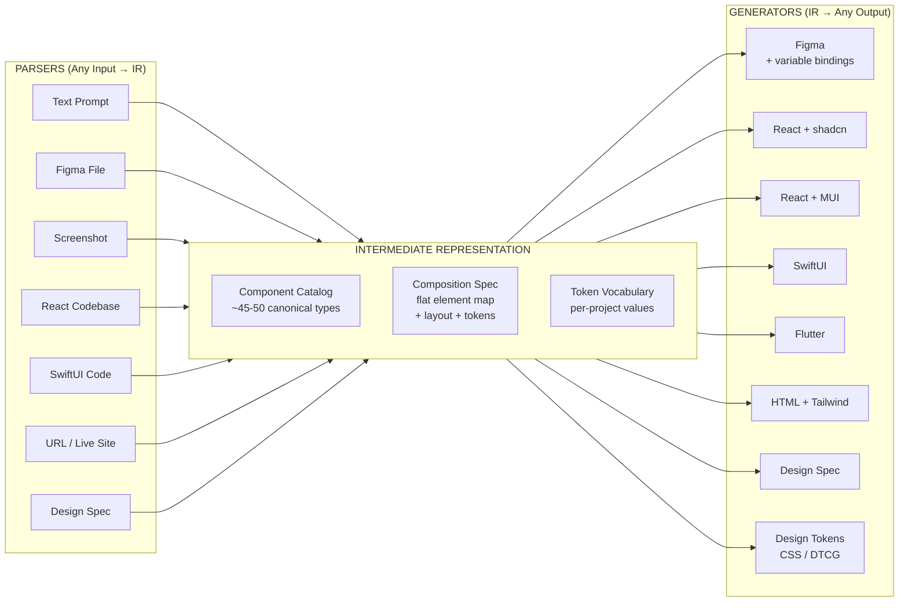
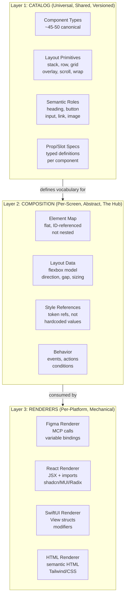
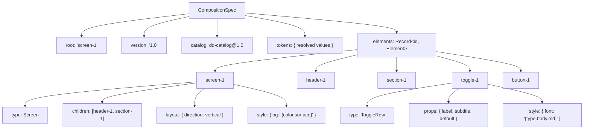
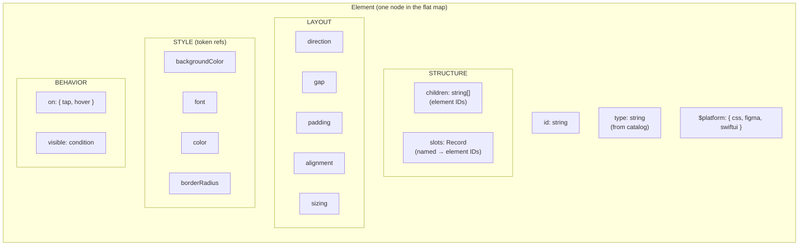
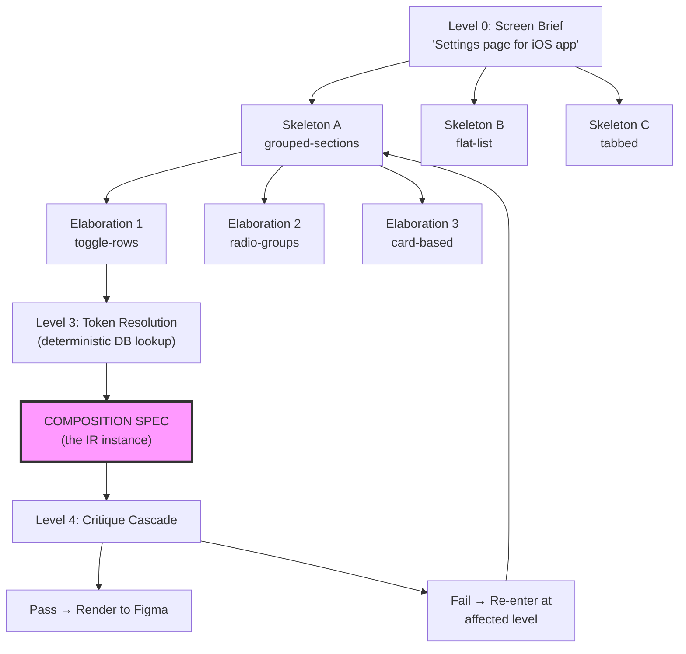
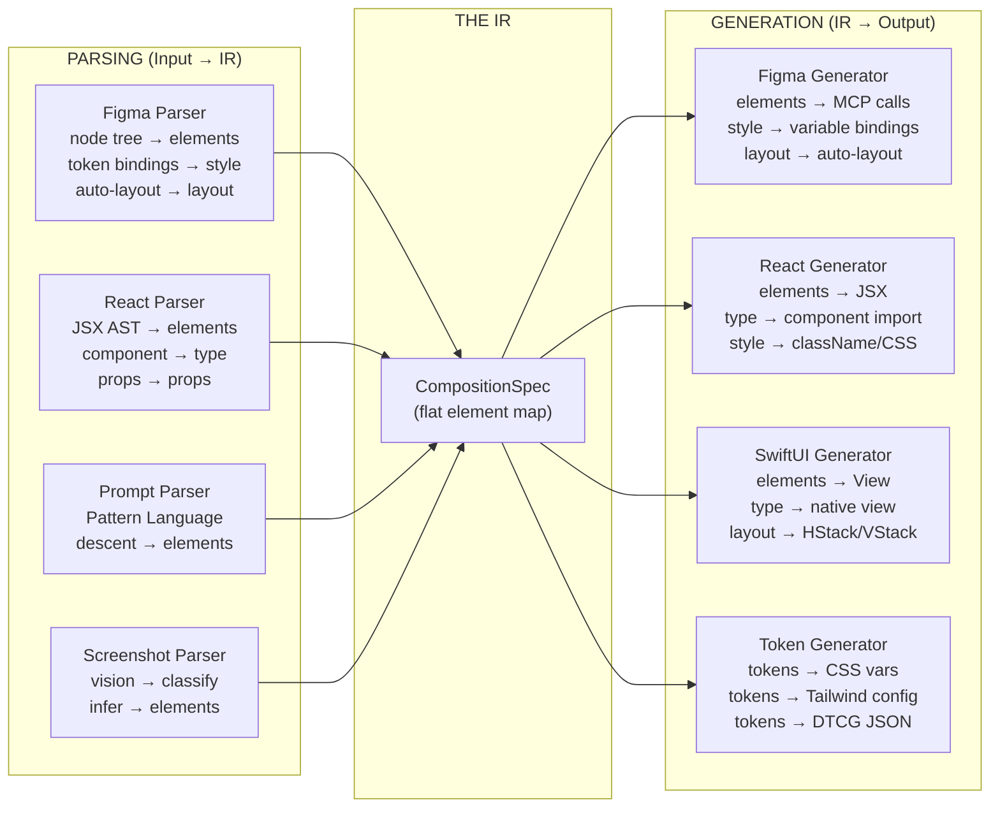
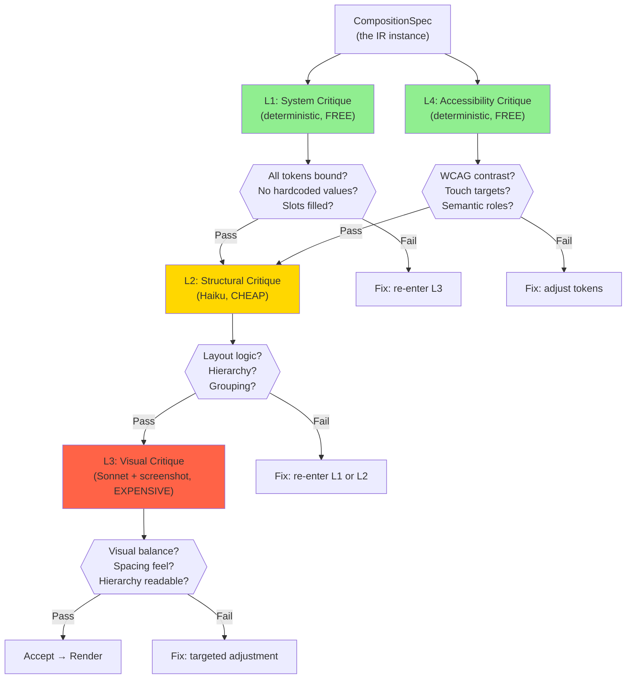
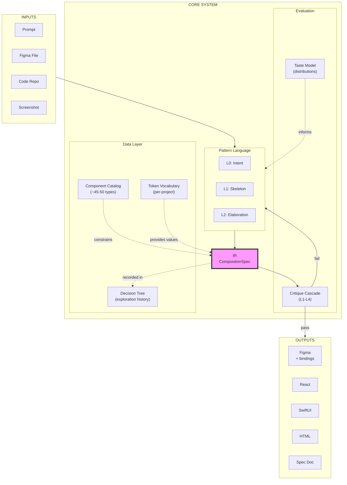

# T5 IR Architecture — Diagrams

Mermaid diagrams expressing the IR architecture, data flow, and internal structure.

---

## 1. Hub-and-Spoke: The IR as Universal Translation Hub

---

## 2. The Three Layers of the IR

---

## 3. Internal Structure of a CompositionSpec

---

## 4. Element Internal Structure (Separated Concerns)

---

## 5. The Pattern Language Operating on the IR

---

## 6. Parsing and Generation Flow (Bidirectional)

---

## 7. The Critique Cascade on IR Data

---

## 8. The Full System: IR at Center of Everything

