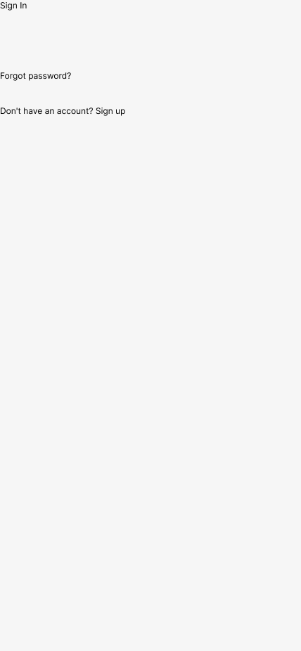
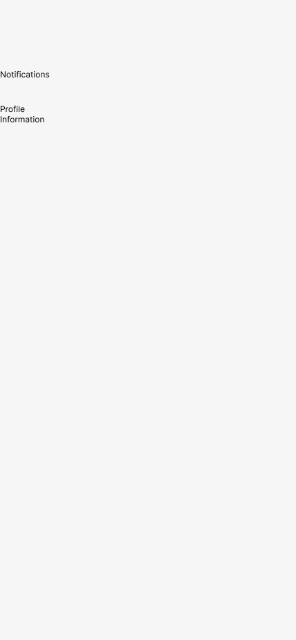
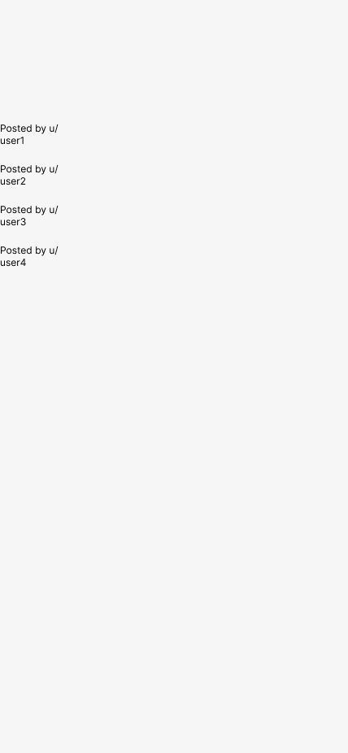
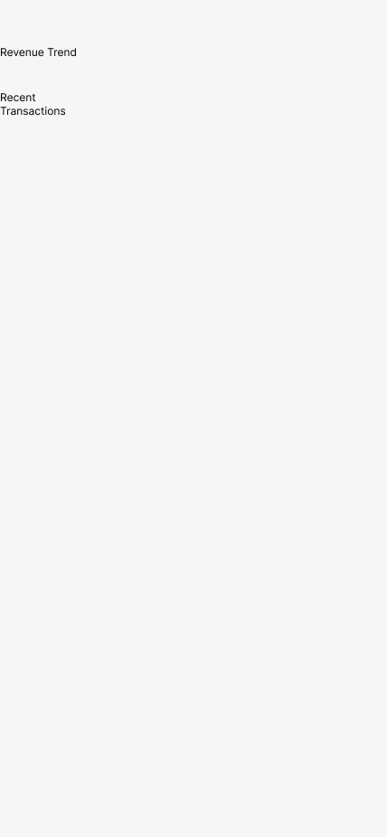
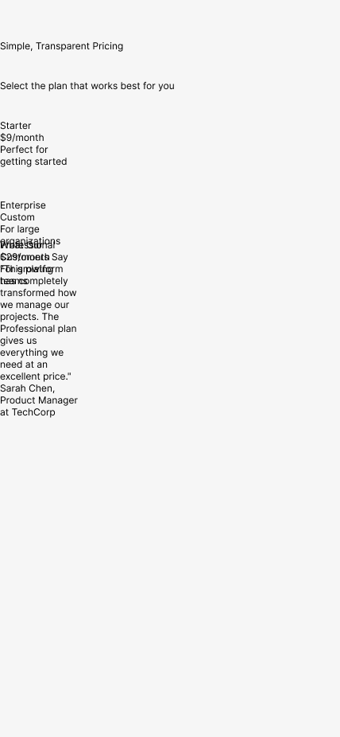
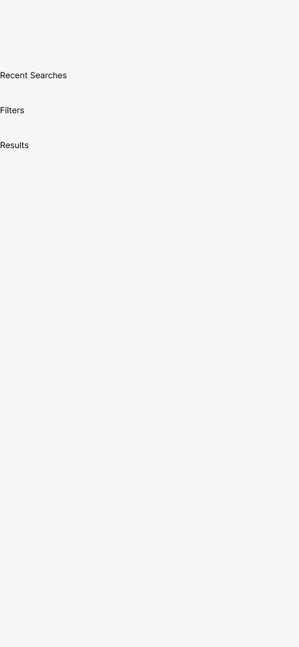
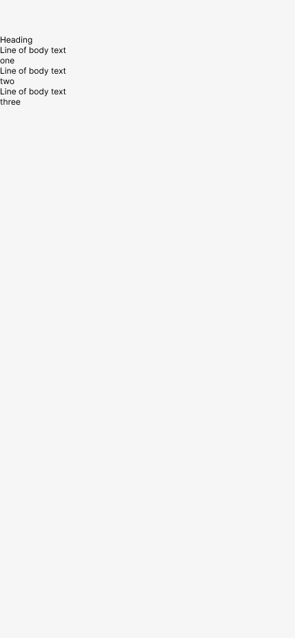
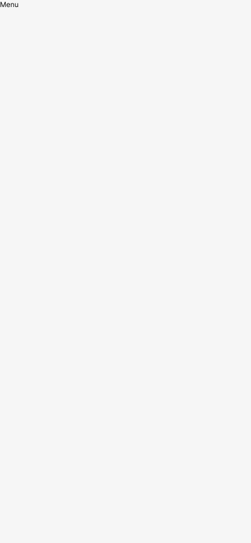
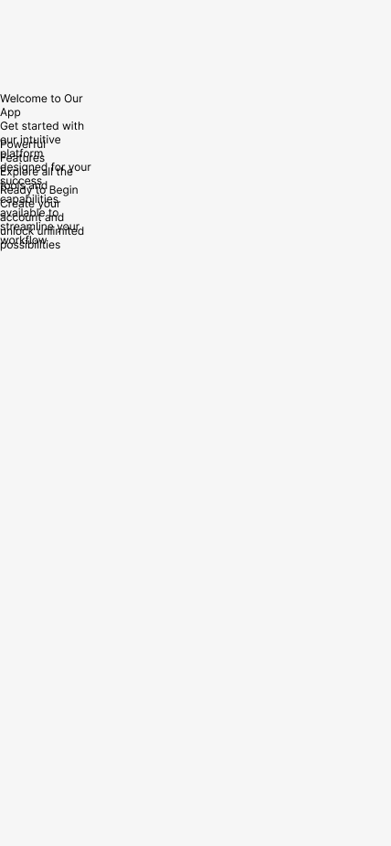
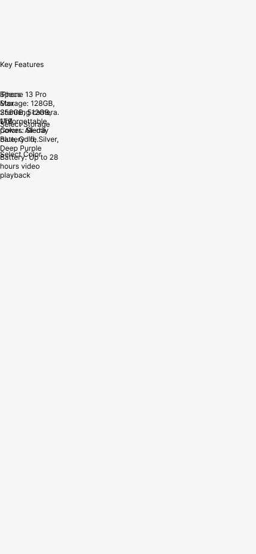

# Wave 2 — designer rating pass

> Fill this in at your own pace. No answers are wrong. The synthesized
> result becomes the ground-truth signal against which Wave 3 (vision
> critic) and Exp D (retrieval impact) get calibrated.
>
> Estimated time: 20–30 minutes total.

## What you're rating

12 screens generated by the current pipeline (Wave 1.5 v3, commit
`880bea8` + `6d38cc7`). The pipeline runs: prompt → Claude Haiku parses
to component list → `compose.py` builds CompositionSpec → `figma.py`
renderer emits Figma script → rendered on the "Generated Test" page in
Dank (Experimental).

**All 12 screens rendered their full subtree** (229 walked eids
vs v2's 39). Zero errors. No crashes. So every rating below is
against actual output, not error-screen stubs.

## How to rate each screen

Look at the screenshot (linked per screen below) OR the rendered
frame in Figma on the "Generated Test" page. For each of the 12:

| Field | What to enter |
|---|---|
| `rendered` | `full` / `partial` / `broken` / `empty` |
| `intent_match` | 1–10. Does it answer the prompt's intent? 10 = "a designer seeing this would recognise it immediately." 1 = "unrelated to prompt." |
| `structural_quality` | 1–10. Hierarchy, grouping, element ordering. Ignoring visual polish. |
| `visual_quality` | 1–10. Polish, spacing, alignment, visual rhythm. Ignoring structure. |
| `failure_modes` | Tags from the taxonomy below (select 0-N). |
| `notes` | One line. What would a designer immediately call out? |

### Failure mode tags

Pick any that apply:

- `flat_stack` — children stacked vertically with no visual hierarchy
- `default_sizes` — everything is 100×100 or visibly uninitialised
- `empty_frames` — components rendered as blank grey rectangles
- `wrong_component` — LLM picked the wrong catalog type for the concept
- `missing_elements` — prompt asked for X, output doesn't have X
- `hardcoded_values` — uses literal hex/px instead of token refs (visible when a "brand" or "design-system" quality is expected and the result feels generic)
- `bad_alignment` — elements not aligned where they should be
- `wrong_hierarchy` — primary/secondary visual weight inverted
- `overlap` — elements overlapping or stacking into the same space
- `wrong_orientation` — horizontal/vertical axis wrong for the content
- `out_of_context` — correct components but arranged like a different app type
- `looks_correct` — designer would accept this as a starting point

---

## The 12 screens

<a id="01-login"></a>
### 01. login

**Prompt:** "a login screen with email, password, and a sign-in button"



```yaml
rendered: 
intent_match: 
structural_quality: 
visual_quality: 
failure_modes: [ ]
notes: 
```

---

<a id="02-profile-settings"></a>
### 02. profile-settings

**Prompt:** "a profile settings page with avatar, name, email, notification toggles, and a save button"



```yaml
rendered: 
intent_match: 
structural_quality: 
visual_quality: 
failure_modes: [ ]
notes: 
```

---

<a id="03-meme-feed"></a>
### 03. meme-feed

**Prompt:** "a feed of memes with upvote and share buttons under each"



```yaml
rendered: 
intent_match: 
structural_quality: 
visual_quality: 
failure_modes: [ ]
notes: 
```

---

<a id="04-dashboard"></a>
### 04. dashboard

**Prompt:** "a data dashboard with a line chart and a table of recent transactions"



```yaml
rendered: 
intent_match: 
structural_quality: 
visual_quality: 
failure_modes: [ ]
notes: 
```

---

<a id="05-paywall"></a>
### 05. paywall

**Prompt:** "a paywall screen with three pricing tiers and a testimonial"



```yaml
rendered: 
intent_match: 
structural_quality: 
visual_quality: 
failure_modes: [ ]
notes: 
```

---

<a id="06-spa-minimal"></a>
### 06. spa-minimal

**Prompt:** "make something minimal and luxurious for a spa app"


```yaml
rendered: 
intent_match: 
structural_quality: 
visual_quality: 
failure_modes: [ ]
notes: 
```

---

<a id="07-search"></a>
### 07. search

**Prompt:** "a search screen"



```yaml
rendered: 
intent_match: 
structural_quality: 
visual_quality: 
failure_modes: [ ]
notes: 
```

---

<a id="08-explicit-structure"></a>
### 08. explicit-structure

**Prompt:** "header with back button, title, share button. Then a card with a heading, 3 lines of body text, and a primary button. Then a secondary button below."



```yaml
rendered: 
intent_match: 
structural_quality: 
visual_quality: 
failure_modes: [ ]
notes: 
```

---

<a id="09-drawer-nav"></a>
### 09. drawer-nav

**Prompt:** "a drawer menu with 6 nav items"



```yaml
rendered: 
intent_match: 
structural_quality: 
visual_quality: 
failure_modes: [ ]
notes: 
```

---

<a id="10-onboarding-carousel"></a>
### 10. onboarding-carousel

**Prompt:** "an onboarding carousel with 3 slides, each with an illustration, headline, and subtext"



```yaml
rendered: 
intent_match: 
structural_quality: 
visual_quality: 
failure_modes: [ ]
notes: 
```

---

<a id="11-vague"></a>
### 11. vague

**Prompt:** "something cool"


```yaml
rendered: 
intent_match: 
structural_quality: 
visual_quality: 
failure_modes: [ ]
notes: 
```

---

<a id="12-round-trip-test"></a>
### 12. round-trip-test

**Prompt:** "rebuild iPhone 13 Pro Max - 109 from scratch"

> Round-trip test: this is the only prompt with a ground-truth target
> (Dank's actual screen 324). A rendering that happens to match the
> original closely is meaningful; one that doesn't is still informative.



```yaml
rendered: 
intent_match: 
structural_quality: 
visual_quality: 
failure_modes: [ ]
notes: 
```

---

## Overall synthesis (after rating all 12)

Answer these briefly after filling in the per-screen fields above:

**1. Biggest single failure mode across all 12.** What would you fix
first if you had to pick one intervention?

**2. Anything surprising.** Did any prompt produce output that felt
better than you expected? Worse? In unexpected ways?

**3. What would make this v0.1-shippable?** If your goal was "non-
designers get usable starting points," what's the minimum the pipeline
needs to change?

**4. Is this the right test corpus?** Would different prompts have
surfaced different issues better?

---

When you're done, save the file (markdown is fine as-is, or convert to
structured YAML if you prefer). Claude will read it and use the
synthesised ratings to calibrate Wave 3 + Exp D without needing further
guidance.
